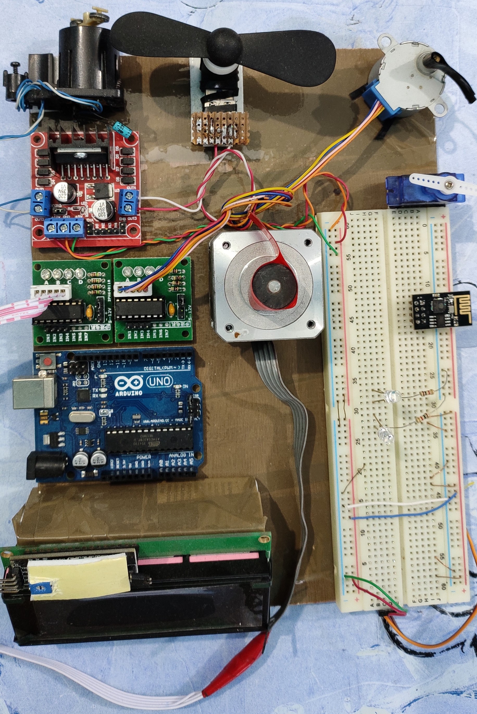

# Industrial_Motor_Controlling_and_Monitoring_System
This is an arduino based simple wireless networking project in which we can control different types of motor in a system.  
 

'Industrial Motor Controlling and Monitoring System' is an interesting project. I had implemented this in the 6th trimester (Summer- 2019) in my graduation life under the course coordinator Md. Bayazid Rahman in the course named Microprocessor and Assembly Language Programming. I was very curious about this project. Because This project is very important for the people who want to know that how a DC, Servo, and Stepper motor works. I have described these three types of motors in detail in this project. I also showed that how a display works and finally how a microcontroller controls every part of the project. An Arduino Uno board is used as a microcontroller that gets all instruction from a complete Arduino program. Again I showed that how a microcontroller gets a new instruction from a network wirelessly using a Wi-Fi or Bluetooth module. I have discussed all the topics in a report of my project.

Supervised By : Md Bayazid Rahman  
Created By : Md Saif Hossain

After a long month of trying, I was able to complete this with a report. I was so happy completing this project. Because it creates a new opportunity of my professional life. So I always feel proud for this project.
